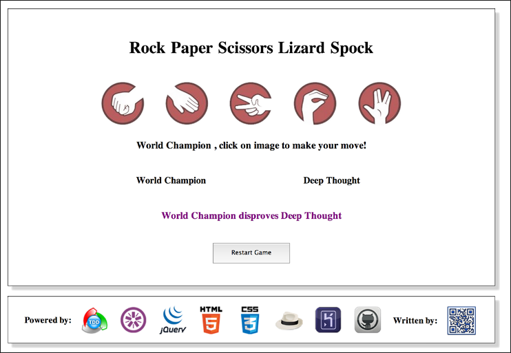

<h1>Rock • Paper • Scissors • Lizard • Spock</h1>

<h3>Description</h3> 

<strong>Bookmark Manager</strong> 

This app was created as an exercise in buiding a complete JavaScript 
web application, using Jquery functionality and TDD methodology
(testing was done with Jasmine).
 

The starting point for this project was provided by Alex Peattie (a coach at Makers) and
consisted of a sample code both in Ruby and JavaScript for the original game, 'rock paper scissors' 
(Alex's code can be found here: https://github.com/alexmakers/rockpaperscissors).

The present code actualizes a slightly more sophisticated version of the game
which includes two additional characters: the lizard and Spock.

The app gives the option of playing the game either with two players or agaist the 
super computer 'Deep Though'.

<h3>How to Play</h3>

First, select game mode: 'Player vs Deep Thought' or Player vs Player

Next, enter name/s of player/s

Here's a quick overview of the rules:

<ul>
	<li>Scissors cut Paper</li>
	<li>Paper covers Rock</li>
	<li>Rock crushes Lizard</li>
	<li>Lizard poisons Spock</li>
	<li>Spock smashes Scissors</li>
	<li>Scissors decapitate Lizard</li>
	<li>Lizard eats Paper</li>
	<li>Paper disproves Spock</li>
	<li>Spock vaporizes Rock</li>
	<li>Rock crushes Scissors</li>
</ul>

(Source: http://en.wikipedia.org/wiki/Rock-paper-scissors-lizard-Spock)

And now it's game time:

If in single player mode: simply click on an image to make your choice 
(Deep Thought is very fast - it has alredy made its choice).

If in dual player mode: each player should click on an image in turn
and after the two choice are made, the result is shown on the screen.

<h3>See it Live on Heroku</h3>

<table>
	<td>
		<tr>	
			
		</tr>
		<tr>		
			A live version of the game can be found (and played!) at:
			http://makers-rock-paper-scissors.herokuapp.com		
		</tr>
	</td>
</table>
<h3>Browser Caveate</h3> 

Please note that this app has been optimized primarily for <strong>Google Chrome</strong>, 
and to a lesser extent <strong>Apple Safari</strong>. However. it should look decent on other
browsers as well.

<h3>Testing</h3> 

Tests were written with Rspec (for Ruby side) & Jasmine (for JavaScript side).

To run the tests for Ruby in terminal:

$ cd ruby

<o>$ rspec

Rspec version: 3.0.3

To run the tests for Javascript in a browser:

In Finder, go to the /javascript directory, and double-click the 'SpecRunner.html' file.

Jasmine version: 2.0.0

